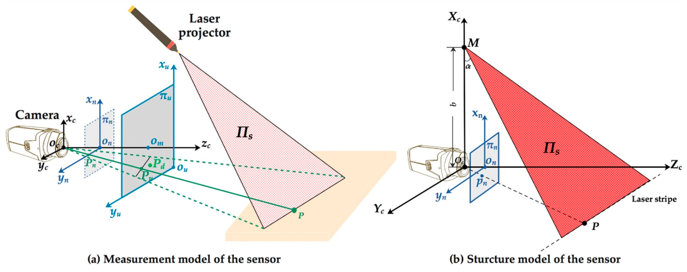

# Structure-Light sensor calibration 

**Update on 2020/07/20.**  

### TODO
- [x] Support different backbones
- [x] Multi-GPU training



### lib
You need to inatall opencv first
    ```Shell
    brew inatall opencv
    ```

### make
Fellow steps below to run the code:

0. Configure your dataset path in ./calib_picture and ./light_picture

1. To train LSDNN using our dataset and ResNet as backbone:
    ```Shell
    cmake .
    make
    ```

### run
After make you can run by:
    ```Shell
    ./target
    ```

### result
You can find the calib result in Parameters.xml
Pointcloud in laser atripe will be saves in pointcloud.txt